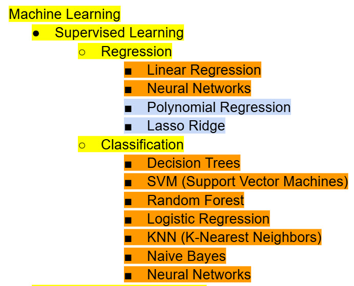
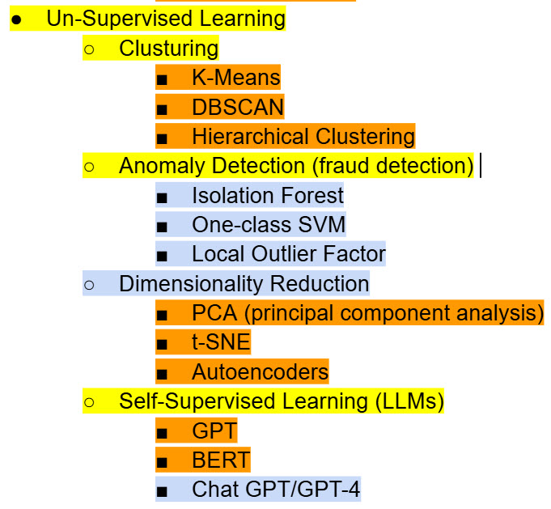

# Tiny-Machine-Learning

Here is a list of the different Machine Learning algorithms (please note that this list is not concrete and I can add changes to it in the future)

**Yellow highlight** = Category of Machine Learning Algorithm

**Orange highlight** = Machine Learning algorithms that only belong to their given category (supervised or unsupervised

**Lightblue highlight** = Machine Learning algorithms that are mainly used in the group that they are assigned to, but can be used in the other category (supervised or unsupervised)

